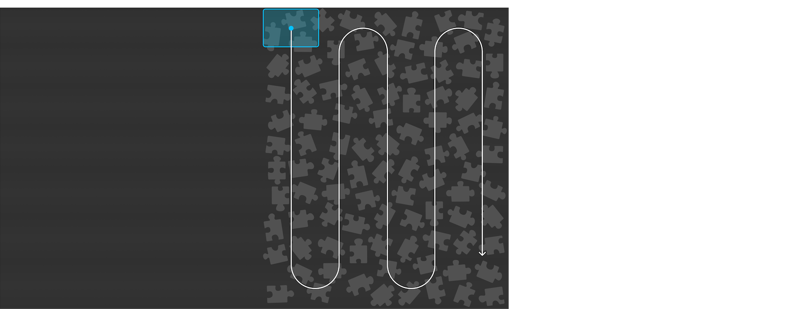
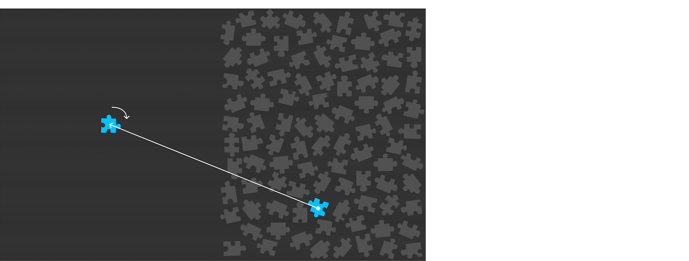
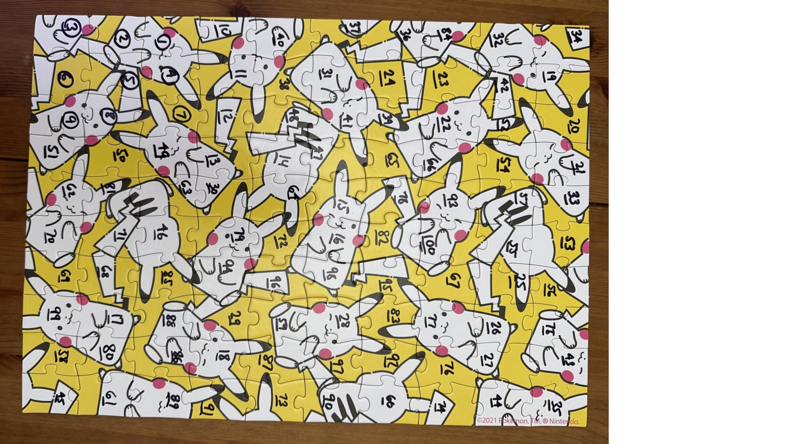

# puzzle-bot

The code that powers a jigsaw puzzle solving robot. This reliably solves a few 1000-piece all-white puzzles. I'm making this somewhat easier on myself by assuming the puzzle pieces come to form a grid, where each piece has four sides.

## Puzzle Solving Overview

1. *Manually lay pieces out in the staging area*
    
    1. Face up
    2. Must have a large enough gap between pieces for there to be 1+ dark pixels in the photos taken
    3. Need not form a grid of any sort
    4. On a black backdrop

2. Provide configuration about our setup:
    1. Edit config.py

3. Robot takes pictures of the staging area along a cornrow path
    
    1. We take in these photos, either one-by-one or all at once
    2. With each photo, we take in the gripper's position when the photo was taken
    2. Photos can have overlap - post-processing will take care of seeing a piece in multiple photos
    

4. Process each photo
    1. Crop the photo by a configurable amount. This allows for faster processing as it is preferable to have photos with pieces closest to the center
    2. Segment the photo into a binary bitmap: 0s are the black background and 1s are pieces (or dust)
    3. Extract each piece from the photo by finding large connected islands of 1s
    4. Clean the extracted piece by removing fine details like dust and hairs
    5. Save off the piece as a binary bitmap

5. Process each piece
    1. Find the edge of the piece in the binary image
    2. Walk along the edge, creating a dense vector path
    4. Detect the four corners of the piece with an algorithm that finds the best four candidates based on a handful of heuristics
    5. "Enhance" the corners by finding where the two sides would intersect, to account for slightly dinged or rounded-off corners
    6. Extract the four sides by yanking all vertices between two consecutive corners
    7. Note which sides are edges by calculating how close to perfectly straight each side is
    8. Compute the best point inside the piece for the robot to grip the piece from, by computing an approximate incenter - the point inside a polygon furthest from the nearest side
    9. Save off the piece's data and metadata about its sides, position in the input photo, etc.

6. Deduplicate pieces that were seen in multiple images
    1. We use the vector data because our test puzzles had printed patterns on them useful for debugging
    2. Compare each piece to every other piece
    3. Eliminate pieces that were taken far enough away in gripper-space
    4. If two pieces were geographically proximal, we compare how similar their four sides are
    5. We only keep one of each duplicate found, and we select the one closest to the center of its photo, to minimize parallax

7. Find all other pieces each piece can feasibly connect with
    1. For each side in each piece, compare the geometric fit to all other pieces' sides
    
        1. _ASCII art showing the solver comparing two sides (green and yellow) and their proximity (white=intersection):_
    2. Save off a list of the most likely fits for each side, sorted by their geometric similarity
        1. Note: small improvements to this part of the algorithm have an outsized impace on solve times. This is because the current solver's runtime complexity blows up quickly as the connectivity of the graph (i.e. how many sides could match) gets denser

8. Solve the puzzle
    1. Grab one of the four corner pieces (i.e. a piece whose two adjacent sides are edges)
    2. Walk around the edge of the puzzle, exploring each feasible piece that could be connected
    3. **TODO** add a graphic showing the spiral solving pattern
    4. **TODO** add a graphic showing the corner being evaluated with a piece that fits snuggly but isn't an edge, vs one that is
    5. We keep track of not just which position each piece goes in, but its orientation
    6. We do an exhaustive depth-first search until we've placed all 100 pieces

9. Determine how to move each piece from the staging area to the solution area
    1. Compute where the piece should be gripped from, dropped off to, and how much it needs to be rotated
    
    2. TODO - detail out how this works, and how spiral-order works

10. Assemble the puzzle in spiral-order
    1. e.g. spiral from edge, spiral from center, evens then odds, ...

11. Robot executes these movements

## Results

To start, I solved a kid's puzzle. To help with debugging, I randomly labeled each piece with Sharpie, but the algorithm doesn't use this data at all.



The solution of a 100 piece puzzle, showing each piece's position and orientation:
```
    3^    2^    1^   10<   40>   37>   36v   84<   32<   34v

    6^    5>    4^   11^   38>   31^   24^   23^   42<   19<

    9^    8^    7^   12<   48v   41^   39<   22^   52^   20<

   51<   50^   49<   13<   14<   47^   65^   66^   54<   21<

   62<   81>   63<   30^   64^   15<   78^   93^   57^   33<

   70^   71<   46>   79<   72^   16<   82^  100>   55v   53v

   69<   68<   85v   94^   96^   98^   95v   67<   25<   56>

   99^   17<   88<   29<   59>   28<   83^   77>   26^   75^

   58^   80v   86>   18<   87<   97<   92^   76>   27<   43<

   45^   61v   89^   91<   73<   90<   60^   74<   44^   35v
```
